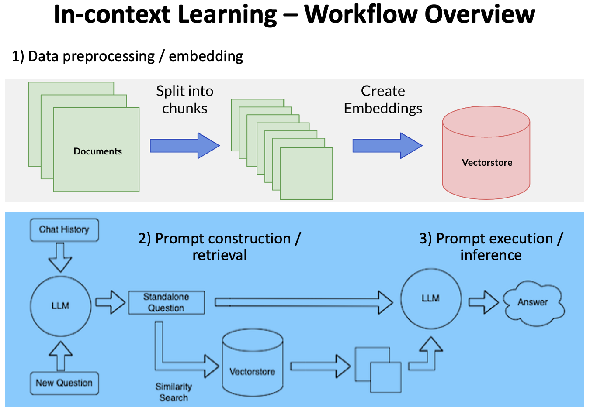

# ChatPDF - Talk to Your PDF Files 

This project uses Open AI and open-source large language models (LLMs) to enable you to talk to your own PDF files.

## How it works

We're using an AI design pattern, namely "in-context learning" which uses LLMs off the shelf (i.e., without any fine-tuning), then controls their behavior through clever prompting and conditioning on private “contextual” data, e.g., texts extracted from your PDF files.

At a very high level, the workflow can be divided into three stages:

1. Data preprocessing / embedding: This stage involves storing private data (your PDF files) to be retrieved later. Typically, the documents are broken into chunks, passed through an embedding model, then stored the created embeddings in a vectorstore.

2. Prompt construction / retrieval: When a user submits a query, the application constructs a series of prompts to submit to the language model. A compiled prompt typically combines a prompt template and a set of relevant documents retrieved from the vectorstore.

3. Prompt execution / inference: Once the prompts have been compiled, they are submitted to a pre-trained LLM for inference—including both proprietary model APIs and open-source or self-trained models.



Tech stack used includes LangChain, Gradio, Chroma and FAISS. 
- LangChain is an open-source framework that makes it easier to build scalable AI/LLM apps and chatbots. 
- Gradio is an open-source Python library that is used to build machine learning and data science demos and web applications.
- Chroma and FAISS are open-source vectorstores for storing embeddings for your files.

## Running Locally

1. Check pre-conditions:

- [Git Large File Storage (LFS)](https://git-lfs.com/) must have been installed.
- Run `python --version` to make sure you're running Python version 3.10 or above.
- The latest PyTorch with GPU support must have been installed. Here is a sample `conda` command:
```
conda install -y pytorch torchvision torchaudio pytorch-cuda=11.8 -c pytorch -c nvidia
```
- [CMake](https://cmake.org/) must have been installed. Here is a sample command to install `CMake` on `ubuntu`:
```
sudo apt install cmake
```

2. Clone the repo

```
git lfs install
git clone https://huggingface.co/spaces/inflaton/learn-ai
```


3. Install packages

```
pip install -U -r requirements.txt
```

4. Set up your environment variables

- By default, environment variables are loaded `.env.example` file
- If you don't want to use the default settings, copy `.env.example` into `.env`. Your can then update it for your local runs.


5. Start the local server at `http://localhost:7860`:

```
python app.py
```

## Duplicate This Space

Duplicate this HuggingFace Space from the UI or click the following link:

- [Duplicate this space](https://huggingface.co/spaces/inflaton/learn-ai?duplicate=true)

Once duplicated, you can set up environment variables from the space settings. The values there will take precedence of those in `.env.example`.

Check out the configuration reference at https://huggingface.co/docs/hub/spaces-config-reference

## Talk to Your Own PDF Files

- The sample PDF books & documents are downloaded from the internet (for SMU Library Chatbot) and [PCI DSS official website](https://www.pcisecuritystandards.org/document_library/?category=pcidss) and the corresponding embeddings are stored in folders `data/ai_books` and `data/pci_dss_v4` respectively, which allows you to run locally without any additional effort.

- You can also put your own PDF files into any folder specified in `SOURCE_PDFS_PATH` and run the command below to generate embeddings which will be stored in folder `FAISS_INDEX_PATH` or `CHROMADB_INDEX_PATH`. If both `*_INDEX_PATH` env vars are set, `FAISS_INDEX_PATH` takes precedence. Make sure the folder specified by `*_INDEX_PATH` doesn't exist; other wise the command will simply try to load index from the folder and do a simple similarity search, as a way to verify if embeddings are generated and stored properly. Please note the HuggingFace Embedding model specified by `HF_EMBEDDINGS_MODEL_NAME` will be used to generate the embeddings.

```
python ingest.py
```

- Once embeddings are generated, you can test them out locally, or check them into your duplicated space. Please note HF Spaces git server does not allow PDF files to be checked in.

## Play with Different Large Language Models

The source code supports different LLM types - as shown at the top of `.env.example`

```
# LLM_MODEL_TYPE=openai
# LLM_MODEL_TYPE=gpt4all-j
# LLM_MODEL_TYPE=gpt4all
# LLM_MODEL_TYPE=llamacpp
LLM_MODEL_TYPE=huggingface
# LLM_MODEL_TYPE=mosaicml
# LLM_MODEL_TYPE=stablelm
# LLM_MODEL_TYPE=openllm
# LLM_MODEL_TYPE=hftgi
```

- By default, the app runs `lmsys/fastchat-t5-3b-v1.0` model with HF Transformers, which works well with most PCs/laptops with 32GB or more RAM, without any GPU. It also works on HF Spaces with their free-tier: 2 vCPU, 16GB RAM and 500GB hard disk, though the inference speed is very slow.

- Uncomment/comment the above to play with different LLM types. You may also want to update other related env vars. E.g., here's the list of HF models which have been tested with the code:

```
# HUGGINGFACE_MODEL_NAME_OR_PATH="databricks/dolly-v2-3b"
# HUGGINGFACE_MODEL_NAME_OR_PATH="databricks/dolly-v2-7b"
# HUGGINGFACE_MODEL_NAME_OR_PATH="databricks/dolly-v2-12b"
# HUGGINGFACE_MODEL_NAME_OR_PATH="TheBloke/wizardLM-7B-HF"
# HUGGINGFACE_MODEL_NAME_OR_PATH="TheBloke/vicuna-7B-1.1-HF"
# HUGGINGFACE_MODEL_NAME_OR_PATH="nomic-ai/gpt4all-j"
# HUGGINGFACE_MODEL_NAME_OR_PATH="nomic-ai/gpt4all-falcon"
HUGGINGFACE_MODEL_NAME_OR_PATH="lmsys/fastchat-t5-3b-v1.0"
# HUGGINGFACE_MODEL_NAME_OR_PATH="meta-llama/Llama-2-7b-chat-hf"
# HUGGINGFACE_MODEL_NAME_OR_PATH="meta-llama/Llama-2-13b-chat-hf"
# HUGGINGFACE_MODEL_NAME_OR_PATH="meta-llama/Llama-2-70b-chat-hf"
```
